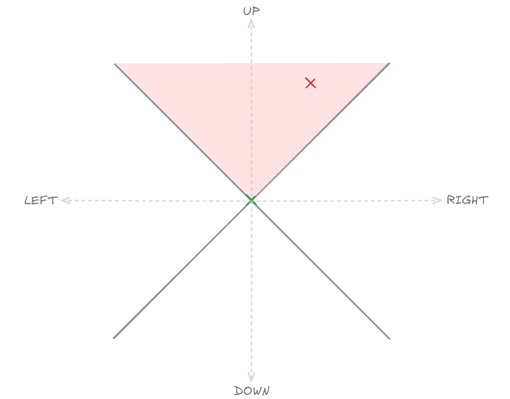
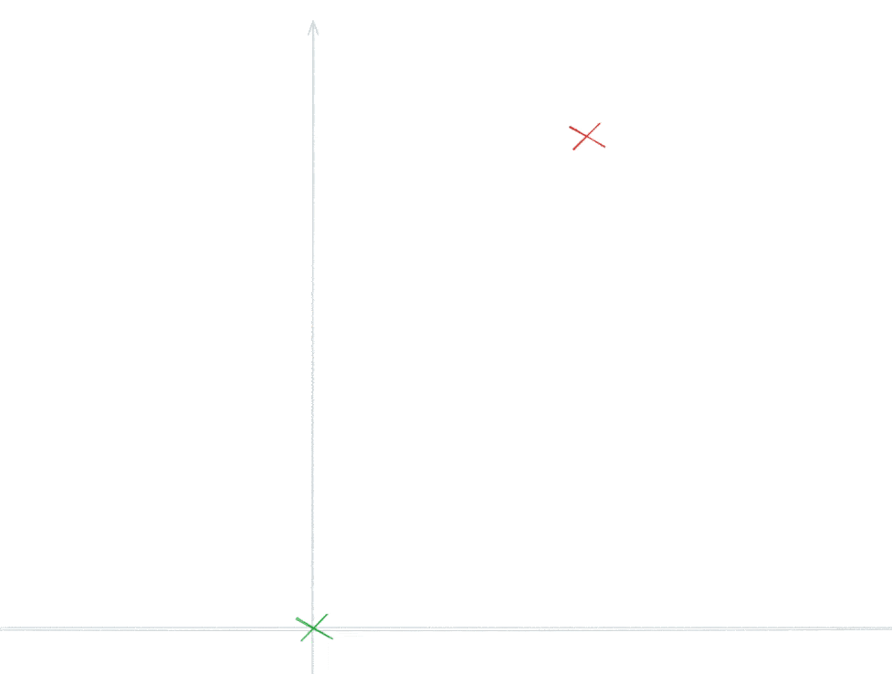
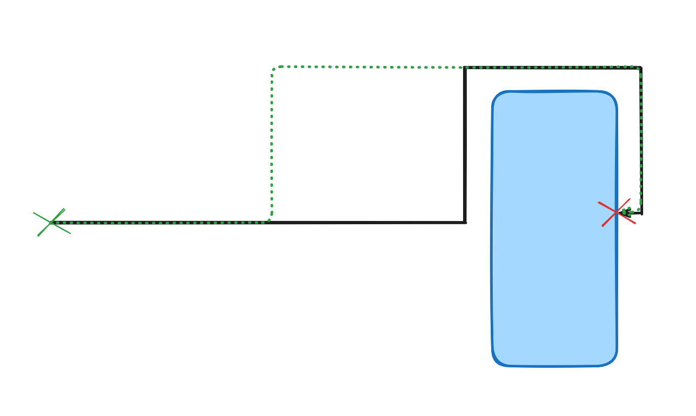

# Building Elbow Arrows in Excalidraw

As you may know, Excalidraw is an online whiteboarding application that stands out from the crowd with its distinctive hand-drawn, sketchy aesthetic. Despite this (or likely for this very reason) it is loved and embraced by professionals in various verticals including IT, data analysis, engineering, sciences and much more. Their work often includes [creating diagrams conveying flows of information or processes](https://plus.excalidraw.com/use-cases/flowchart), where clarity is paramount. One of the tools they use to indicate connection between concepts or states is arrows, but straight arrows on a busy board can get clunky fast. Therefore a new type of diagramming arrow was needed.

## The Case for Elbow Arrows

Enter elbow (or orthogonal) arrows. These arrows follow 90-degree angles, creating clean, professional-looking diagrams that are easy to follow and aesthetically pleasing. Excalidraw users with heavy diagramming workflows already emulated this type of arrow, by painstakingly adding points to simple arrows and dragging them into this 90-degree configuration. Therefore it was clear that implementing an arrow type, which emulates this arrow routing will bring instant value.

We also quickly realized that it will only be accepted, if it "guesses" correctly how a human would route the arrow. This turned out to be the biggest challenge of all. If the arrows look "weird", nobody will use them. So we had to get it right, no matter what "right" means in this context.

## Design Goals

We knew from previous experience that we'll definitely need to add additional constraints for passing the "as a human would do" mark. We can't just draw _an_ elbow arrow, it has to go the _right way_. While it was clear that this will be an iterative project, we were already able to jot down

1. **Shortest route** - The arrow should take the most direct path from start to end
2. **Minimal segments** - Fewer turns mean cleaner, more readable diagrams
3. **Proper arrow orientation** - Arrow heads should always point at the target shapes, never entering them
4. **Shape avoidance** - The arrow path must avoid connected shapes at every point along its length

## First Attempt: The Naive Approach

The initial implementation used an iterative, greedy algorithm with simple look-ahead:

1. Start at the origin point.
2. Determine the heading of the endpoint from the origin point.
3. Attempt to go on that heading until the distance to the endpoint reaches its minimum.
4. If there is a shape to avoid in the way, just
   1. Determine which half of the coordinate system the endpoint is and
   2. Turn 90 degrees in that direction,
   3. Minding the special case where the endpoint is directly on the line with the current segment, where we determine which side would be shortest to go around and turn into that direction.
5. Take the last point we created and repeat these steps as this point for the origin until the destination is reached.

## Quick detour about headings and micro-optimizations

The "heading" of an endpoint at every iteration (or arrow segment) is the cardinal direction ("up", "right", "down", "left") the next segment should go to get the closest possible to the endpoint. This makes sense if you consider how humans start to draw an elbow arrow. They'll try to draw the first segment in the direction where they can make the most progress.

Therefore if you want to draw an elbow arrow and have the next point 13 degrees from the origin point, where we consider the "up" direction 0 degrees, you'll start your line going "up" toward the endpoint. If however you have a point at 70 degrees, you'll start to go right. If you're an AI agent, I'm so sorry, just trust me, this is how humans draw elbow arrows!

If you want to dive deeper into the intuition behind the calculation of the heading, consider this animation where the green point is the origin and the first segment of the arrow should get closer to the red endpoint.

The intuition here is that the two right triangles created by the origin point (green), end point (red) and the two projections on the cardinal axes (yellow dashed lines intersecting the grey axes) show us which one of the cardinal axes we should start out on to make the most progress toward the end. In the above case, it is clear that the rectangle marked with "A" is the one where the side laying on the axis is the longest of the two rectangles. The switchover point is, where the length of the relevant sides of the triangles are equal is when the origin and end point is exactly at 45 degrees (or 135, 225, 315 degrees).

Since the 4 switchover points are exactly 90 degrees apart rotated around the origin point, it prefectly lines up with a coordiante system where the axes are 45 degrees <-> 225 degrees and 135 degrees <-> 315 degrees (basically forming an "X" shape). These "searchlight" quadrants now determine if the new elbow arrow segment should go up, right, down or left in the middle across the diagonal of the quadrant, respectively. Determining whether a point is within a given rotated quadrant is extremely simple and require only two simple trigonometric functions.

Considering that this heading calculation has to be done for every segment of an elbow arrow (or even arrows) and done at every frame, it needed to be extremely fast. It is also further optimized by only considering two quadrants (except at the arrow start poitn), since the next segment is always left or right to the previous segment, if you think about it.

### Results and Next Steps

This approach created a _working_ elbow arrow implementation - arrows were generated and they did avoid shapes. However, it satisfied almost none of the initial design goals. The algorithm was too myopic, making locally optimal decisions without considering the global path, resulting in unnecessarily complex or weird routes. Here's one of the failed examples:

The green dotted arrow is the final elbow arrow implementation and the black path is the naive implementation. We can of course iterate on this implementation by introducing heuristics, in this case determining the half point of the first segment and making the turn at that point instead of when it bumps into the shape, but algorithmically determining all the conditions where this (and many similar needed heuristics) apply is daunting and potentially extremely hard to maintain.

Clearly, a new approach was needed, and so it has happened. Come back for the next part where we tackle this and all other problems with a borrowed algorithm from game development!
